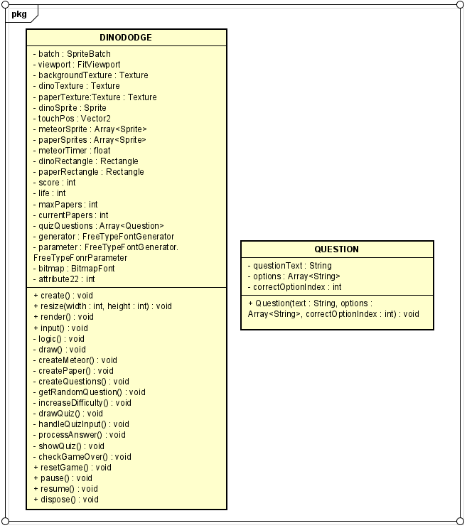

# Dino Dodge

## Autoria

**Nome:** Guilherme Fereira da Silva\
**Curso:** Ciencia da Computação\
**Disciplina: Paradigmas de Programação**

## Sobre o Jogo

**Dino Dodge** é um jogo desenvolvido com a biblioteca libGDX. O jogador controla um dinossauro que desvia de meteoros e coleta papéis. Quando um papel é coletado, um quiz temático é exibido. Responder corretamente concede pontos, enquanto respostas erradas aumentam a dificuldade do jogo.

### Objetivo

Sobreviver o maior tempo possível, acumulando pontos ao acertar os quizzes e evitando meteoros para manter as vidas.

## Processo de Desenvolvimento

### Ferramentas Utilizadas

- **Linguagem de Programação:** Java
- **Biblioteca Gráfica:** libGDX
- **Fontes:** FreeTypeFontGenerator para criação de fontes personalizadas
- **IDE:** VScode

### Principais Recursos do Jogo

1. **Sprites e Texturas:** Gerenciamento de objetos gráficos como o dinossauro, meteoros e papéis.
2. **Sistema de Colisão:** Implementado com o uso de objetos `Rectangle` para detectar interações entre o dinossauro e os outros objetos.
3. **Sistema de Perguntas(incompleto):**
   - Cada quiz possui uma pergunta com três opções de resposta.
   - Uma resposta correta concede 20 pontos, enquanto uma errada aumenta a dificuldade do jogo.
4. **Aumento Progressivo da Dificuldade:** Após respostas erradas ou colisões, mais meteoros são gerados e sua velocidade aumenta.
5. **Gerenciamento de Estado(incompleto):** Alternação entre o estado normal do jogo e o modo de quiz.

### Comentários do Processo de Desenvolvimento

No geral a parte mais custosa do desenvolvimento do jogo foi me ambientar com a libGDX e entender suas funcionalidades, como por exemplo: o ciclo de vida do jogo, como fazer o setup do projeto de acordo com o que eu queria, como rodar o jogo, etc. Essa etapa do desenvolvimento foi o que me impediu de poder avançar mais com o jogo, visto que fiquei quase duas semanas tentando entender como funciona, produzindo dois jogos anteriormente como forma de treino. O jogo foi feito em cima da base do "a simple game" fornecido pela propria libGDX, porém na implementação do quiz e, principalmente, das fontes, tive problemas que não consegui concluir a tempo da deadline. Infelizmente, o jogo não foi completamente concluido e nem todos os bugs foram removidos, porém fica como aprendizado esse trabalho e todo o conhecimento prático que tive.

## Diagrama de Classes
O diagrama de classes UML foi feito a partir da ferramenta AstahUMl

## Como Jogar

1. Use o mouse ou toque para movimentar o dinossauro horizontalmente.
2. Desvie dos meteoros para evitar perder vidas.
3. Colete papéis para abrir quizzes.
4. Responda às perguntas pressionando as teclas **1**, **2** ou **3**.
5. Pontue ao acertar as respostas e sobreviva o maior tempo possível.

## Referências

1. [Documentação Oficial do libGDX](https://libgdx.com/documentation/)
2. [Exemplo de Jogos Simples com libGDX](https://github.com/libgdx/libgdx/wiki/Simple-game-structure)
3. [Aprenda Java Criando um Jogo 2D com LibGDX:](https://www.youtube.com/watch?v=2bmvlwvnirk)
4. ChatGPT (utilizado para construir o diagrama de classes e a estruturar esse README)

